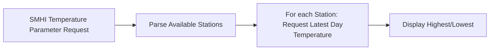

# Weather data

This repo contains the solution to the SMHI Open API Integration

## Getting Started

The code is developed with Python 3.9

1. Setting up a virtual environment

	````
	$ python3 -m venv .venv
	$ .venv/bin/activate
	````

2.  Installing dependencies

	````
	$ python3 -m pip install .
	````

## Exercise 1 - Fetching Available Parameters

In this exercise, all available parameters will be extracted from SMHI Open Data API.

#### Example usage:

````
$ python3 -m smhi.main --parameters
````

#### Expected Output:

````
1. Lufttemperatur (momentanvärde, 1 gång/tim)
2. Lufttemperatur (medelvärde 1 dygn, 1 gång/dygn, kl 00)
3. Vindriktning (medelvärde 10 min, 1 gång/tim)
4. Vindhastighet (medelvärde 10 min, 1 gång/tim)
5. Nederbördsmängd (summa 1 dygn, 1 gång/dygn, kl 06)
... ...
39. Daggpunktstemperatur (momentanvärde, 1 gång/tim)
40. Markens tillstånd (momentanvärde, 1 gång/dygn, kl 06)
````

 #### Solution Flow Chart

API Call:
 1. GET /api/version/latest/parameter

## Exercise 2 - Fetching Daily Temperature

In this exercise, the daily temperature of each station will be fetched (if available). And the highest/lowest temperatures with the corresponding station names will be displayed as the result.

 #### Example usage:

````
$ python3 -m smhi.main --temperatures
````

 #### Example output (2024.09.26):

 ````
 Highest temperature: Fårösund Ar A, 16.5 degrees
Lowest temperature: Tarfala A, -0.9 degrees
````

 #### Solution Flow Chart


API Call:
 1. GET /api/version/latest/parameter/2.json
 2. Async GET  /api/version/latest/parameter/2/station/{station_id}/period/latest-day.json

## Exercise 3 - Unit Tests

Unit tests for functions inside class SMHIDataAPI.

#### Example Usage

````
python3 -m pytest
````

#### Expected Output
````

============================== test session starts =============================
platform darwin -- Python 3.9.6, pytest-6.2.5, py-1.11.0, pluggy-1.5.0
rootdir: /Users/hongyiz/Desktop/trustly/de-assignment
plugins: asyncio-0.20.3, mock-3.14.0
asyncio: mode=strict
collected 13 items

tests/test_smhi_api.py .............                                      [100%]

=============================== 13 passed in 0.66s =============================


````

#### Coverage Report
````
Name                   Stmts   Miss Branch BrPart  Cover   Missing
------------------------------------------------------------------
src/smhi/smhi_api.py      81      4     24      3    93%   49-51, 62, 86->89, 103->102
------------------------------------------------------------------
TOTAL                     81      4     24      3    93%

1 file skipped due to complete coverage.
````

## Troubleshooting

If an SSL certificate verification error occurs (`SSL: CERTIFICATE_VERIFY_FAILED`), usually on windows machine, try to solve it by installing the package `pip-system-certs`

````
$ python3 -m pip install pip-system-certs
````
